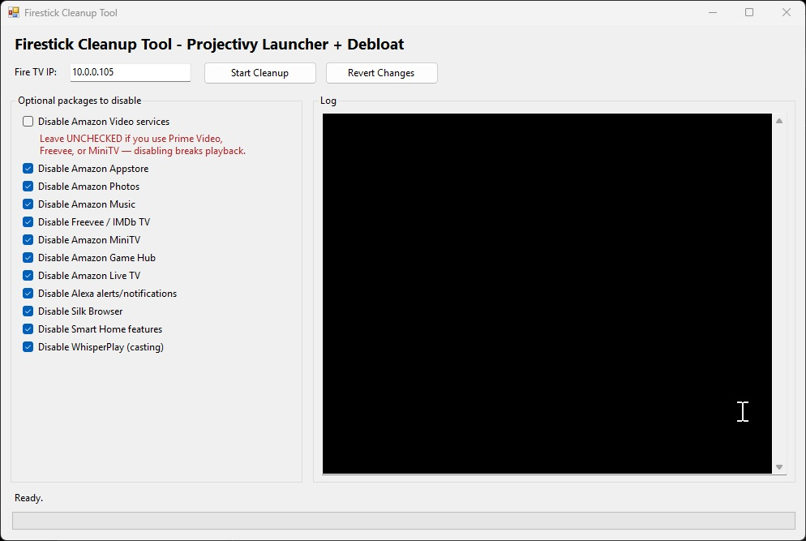

# Firestick Cleanup



Automated tool to replace the ad-filled Amazon Fire TV launcher with [Projectivy Launcher](https://github.com/nickaknudson/tv.projectivy.launcher) and disable Amazon bloatware — no root required.

## What It Does

1. Connects to your Fire TV over ADB (WiFi)
2. Downloads and installs the latest Projectivy Launcher
3. Configures Projectivy as the default launcher
4. Asks which optional Amazon apps you want to keep (Music, Photos, Appstore, etc.)
5. Disables all tracking/telemetry/bloat automatically + your optional choices
6. Reboots, verifies persistence, and re-applies anything Amazon re-enables
7. Shows before/after RAM comparison

## Prerequisites

### ADB (Android Debug Bridge)

ADB is **bundled** in the `adb/` folder — no separate installation needed. The script automatically uses the bundled copy.

### Enable ADB on Fire TV

1. Go to **Settings > My Fire TV > About**
2. Click **Fire TV Stick** (the device name) 7 times to enable Developer Options
3. Go back to **Settings > My Fire TV > Developer Options**
4. Enable **ADB Debugging**
5. Enable **Apps from Unknown Sources**
6. Note your Fire TV's IP address from **Settings > My Fire TV > About > Network**

## Usage

### Install & Clean Up

Double-click `Firestick-Cleaner-And-Launcher-Replacer.bat` or run from command prompt:

```
Firestick-Cleaner-And-Launcher-Replacer.bat
```

### Revert All Changes

```
Firestick-Cleaner-And-Launcher-Replacer.bat --revert
```

This re-enables all disabled packages, removes Projectivy, and restores all settings to stock.

## What Gets Disabled

The script splits packages into two categories:

- **Always disabled** — Tracking, telemetry, ads, and background services. These are always removed with no prompt.
- **Optional (Y/N prompt)** — Apps you might actually use (Amazon Music, Photos, Appstore, etc.). The script asks you for each one before disabling.

Some packages may be protected by Amazon on certain firmware versions — the script handles these gracefully and reports them.

### Ads, Tracking & Telemetry

| Package | What It Does |
|---------|-------------|
| `com.amazon.tv.acr` | **Automatic Content Recognition** — tracks what you watch on screen, even non-Amazon content |
| `com.amazon.hybridadidservice` | **Advertising ID Service** — provides a unique ad tracking identifier for targeted ads |
| `com.amazon.perfc` | **Performance Collection** — collects device performance data |
| `com.amazon.perfcollection` | **Performance Collection Service** — additional performance telemetry |
| `com.amazon.device.telemetry.emitter` | **Telemetry Emitter** — sends device telemetry data to Amazon servers |
| `com.amazon.wirelessmetrics.service` | **Wireless Metrics** — collects WiFi/Bluetooth usage data |

### Optional Apps (Y/N Prompt)

The script asks you whether to disable each of these — answer N to keep ones you use:

| Package | What It Does |
|---------|-------------|
| **Amazon Video services** (group) | **DRM / playback stack** — disables all 6 packages below. Answer **N** if you use Prime Video, Freevee, or MiniTV, or content in those apps will not load. |
| `com.amazon.avls.experience` | **AVLS** — Amazon Video Licensing Service (DRM) |
| `com.amazon.prism.android.service` | **Prism** — Amazon's media playback framework |
| `com.amazon.dp.logger` | **Digital Products Logger** — required by Prime Video for telemetry |
| `com.amazon.livedeviceservice` | **Live Device Service** — live/streaming device coordination |
| `com.amazon.rtcsessioncontroller` | **RTC Session Controller** — streaming session manager |
| `com.amazon.client.metrics.api` | **Metrics API** — required for many Amazon apps to start |
| `com.amazon.venezia` | **Amazon Appstore** — Amazon's app store (you can sideload apps instead) |
| `com.amazon.bueller.photos` | **Amazon Photos** — cloud photo app |
| `com.amazon.bueller.music` | **Amazon Music** — music streaming app |
| `com.amazon.imdb.tv.android.app` | **Freevee / IMDb TV** — Amazon's ad-supported streaming service |
| `com.amazon.minitv.android.app` | **MiniTV** — Amazon's short-form video service |
| `com.amazon.gamehub` | **Game Hub** — Amazon's game discovery service |
| `com.amazon.tv.livetv` | **Live TV** — Amazon's live TV integration |
| `com.amazon.tv.alexaalerts` | **Alexa Alerts** — Alexa notification alerts on screen |
| `com.amazon.tv.alexanotifications` | **Alexa Notifications** — Alexa push notifications |
| `com.amazon.audiohome` | **Audio Home** — Alexa audio/smart home dashboard |
| `com.amazon.cloud9` | **Silk Browser** — Amazon's web browser |
| `com.amazon.smarthomemapviewapp` | **Smart Home Map** — Alexa smart home floor plan view |
| `com.amazon.whisperplay.service.install` | **WhisperPlay** — second-screen/casting service |

### Shopping (Always Disabled)

| Package | What It Does |
|---------|-------------|
| `com.amazon.shoptv.client` | **Shop from TV** — Amazon shopping integration |
| `com.amazon.shoptv.firetv.client` | **Shop from Fire TV** — Fire TV-specific shopping overlay |

### Screensaver & UI Bloat

| Package | What It Does |
|---------|-------------|
| `com.amazon.ftv.screensaver` | **Screensaver** — ad-filled screensaver that displays Amazon promotions |
| `com.amazon.tv.ftvambient` | **Ambient Mode** — ambient display mode with Amazon content |
| `com.amazon.sneakpeek` | **Sneak Peek** — preview/promotional content popups |
| `com.amazon.tv.turnstile` | **Content Suggestions** — "recommended" content that's mostly ads |
| `com.amazon.tv.notificationcenter` | **Notification Center** — Amazon promotional notifications |
| `com.amazon.tv.releasenotes` | **Release Notes** — "what's new" screens after updates |
| `com.amazon.storm.lightning.tutorial` | **Setup Tutorial** — first-run tutorial (not needed after setup) |
| `com.amazon.tmm.tutorial` | **Tutorial Manager** — additional tutorial/walkthrough screens |

### Amazon Background Services (Always Disabled)

| Package | What It Does |
|---------|-------------|
| `com.amazon.logan` | **Log Agent** — Amazon logging service |
| `com.amazon.fireos.cirruscloud` | **Cirrus Cloud** — Amazon cloud sync service |
| `com.amazon.ods.kindleconnect` | **Kindle Connect** — Kindle device linking |
| `com.amazon.tahoe` | **Tahoe** — Amazon content delivery service |
| `com.amazon.aria` | **Aria** — Amazon background service framework |
| `com.amazon.hedwig` | **Hedwig** — Amazon push notification delivery |
| `com.amazon.tv.support` | **TV Support** — Amazon remote support/diagnostics tool |
| `com.amazon.ceviche` | **Ceviche** — Amazon A/B testing and experimentation framework |
| `com.amazon.d3` | **D3** — Amazon device data service |
| `com.amazon.device.rdmapplication` | **Remote Device Management** — allows Amazon to remotely manage your device |
| `com.amazon.wifilocker` | **WiFi Locker** — shares your WiFi password with Amazon |
| `com.amazon.spiderpork` | **SpiderPork** — Amazon background analytics service |
| `com.amazon.firebat` | **FireBat** — Amazon device battery/power analytics |
| `com.amazon.ssm` | **SSM** — Amazon systems manager agent |
| `com.amazon.ssmsys` | **SSM System** — Amazon systems manager system service |
| `com.amazon.tv.easyupgrade` | **Easy Upgrade** — prompts to upgrade to newer Fire TV devices |
| `com.amazon.dpcclient` | **DPC Client** — device policy controller for Amazon management |
| `com.amazon.sharingservice.android.client.proxy` | **Sharing Service** — Amazon cross-device sharing |
| `com.amazon.privacypassservice` | **Privacy Pass** — Amazon privacy token service |
| `com.amazon.tv.legal.notices` | **Legal Notices** — legal disclaimer screens |

### Protected by Amazon (Cannot Disable Without Root)

These packages are protected at the system level. The script detects and skips them automatically:

| Package | What It Does |
|---------|-------------|
| `com.amazon.tv.launcher` | **Stock Launcher** — Amazon's home screen (runs in background ~110 MB) |
| `com.amazon.device.software.ota` | **OTA Updates** — Fire OS update service |
| `com.amazon.device.metrics` | **Core Metrics** — system-level metrics collection |
| `com.amazon.client.metrics` | **Client Metrics** — client-side metrics framework |
| `com.amazon.ftvads.deeplinking` | **Ad Deeplinking** — routes ad clicks to content |
| `com.amazon.tv.forcedotaupdater.v2` | **Forced OTA Updater** — forces system updates |
| `com.amazon.device.software.ota.override` | **OTA Override** — override mechanism for updates |
| `com.amazon.device.logmanager` | **Log Manager** — system log management |
| `com.amazon.device.sync` | **Device Sync** — syncs device state with Amazon |
| `com.amazon.securitysyncclient` | **Security Sync** — security policy sync service |
| `com.amazon.tv.csapp` | **Customer Service App** — Amazon support app |
| `com.amazon.tv.oobe` | **Out of Box Experience** — initial setup wizard |

## How It Works

Amazon protects the stock launcher as a system package, so it cannot be disabled or uninstalled without root. Instead, Projectivy uses an **Android Accessibility Service** to intercept the Home button press and redirect it to Projectivy's home screen.

The script:
1. Enables `ProjectivyAccessibilityService` via `settings put secure`
2. Assigns the `android.app.role.HOME` role to Projectivy
3. Grants overlay (`SYSTEM_ALERT_WINDOW`) and notification listener permissions
4. Disables bloatware in a loop — if some packages are protected, it reboots and retries in case new ones become available
5. After rebooting, re-applies any disables that Amazon reverted during the reboot

After installation, you need to configure Projectivy on the TV:
1. Open Projectivy **Settings** (long-press the center/select button on the remote)
2. Go to **General**
3. Enable **Override current launcher**

This ensures the Home button always opens Projectivy instead of the Amazon launcher.

## Project Structure

```
Firestick-Cleanup/
├── Firestick-Cleaner-And-Launcher-Replacer.bat  # Main script (no dependencies needed)
├── README.md
└── adb/
    ├── adb.exe            # Android Debug Bridge
    ├── AdbWinApi.dll      # Required ADB library
    ├── AdbWinUsbApi.dll   # Required ADB library
    └── libwinpthread-1.dll # Required threading library
```

## Notes

- **Fire TV updates** may reset these changes. Consider blocking OTA updates at the router level by blocking `softwareupdates.amazon.com` and `fireos-fireos-update.s3.amazonaws.com`.
- All changes are **fully reversible** — run with `--revert` to undo everything.
- The stock Amazon launcher remains running in the background (~110 MB RAM) since Amazon protects it from being disabled. This is unavoidable without root.
- Settings persist through reboots. The script verifies this automatically.
- Tested on Fire TV Stick 4K and Fire TV Stick Lite.

## License

MIT
